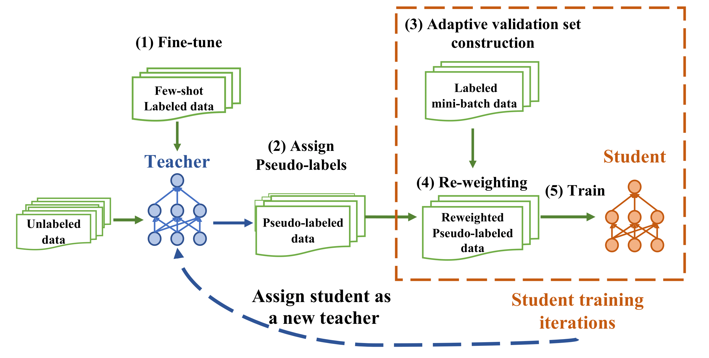

# Meta Self-training for Few-shot Neural Sequence Labeling

This is the implementation of the paper [Meta Self-training for Few-shot Neural Sequence Labeling](https://dl.acm.org/doi/pdf/10.1145/3447548.3467235). MetaST is short for meta-learning for self-training.


## Overview


In this work we present MetaST, a self-training framework with auto data selection technique to prevent error probagation.
You can find more details of this work in our [paper](https://dl.acm.org/doi/pdf/10.1145/3447548.3467235).


## Setup Environment
### Install via pip:

1. create a conda environment running Python 3.6: 
```
conda create --name MetaST python=3.6
conda activate MetaST
```

2.  install the required dependencies:
```
pip install -r requirements.txt
```

### Use docker:
1. Pull docker </br>
``` 
docker pull yaqing/pytorch-meta-st:v0.3
```

2. Run docker </br>
```
docker run -it --rm --runtime nvidia  yaqing/pytorch-meta-st:v0.3 bash
```
Please refer to the following link if you first use docker: https://docs.docker.com/


## Quick start
### Run MetaST

Training on SNIPS </br>
   ```> bash ./scripts/run_snips.sh ```

Note that we ran experiments on V100 GPU (32GB) for base MetaST models. You may need to reduce batch size for other GPUs.

#### Supported datasets:
SNIPS, CONLL03 (En / multilingulal), MIT Movie, MIT restaurant, Wikiann (En / multilingulal) with shot of 5, 10, 20, 100.


#### Supported models:

1. BERT: BERT-based classifier

We will soon add more language model families.


### How do I cite MetaST?

```
@inproceedings{10.1145/3447548.3467235,
author = {Wang, Yaqing and Mukherjee, Subhabrata and Chu, Haoda and Tu, Yuancheng and Wu, Ming and Gao, Jing and Awadallah, Ahmed Hassan},
title = {Meta Self-Training for Few-Shot Neural Sequence Labeling},
year = {2021},
publisher = {Association for Computing Machinery},
address = {New York, NY, USA},
booktitle = {Proceedings of the 27th ACM SIGKDD Conference on Knowledge Discovery & Data Mining},
pages = {1737–1747},
series = {KDD '21}
}
```

